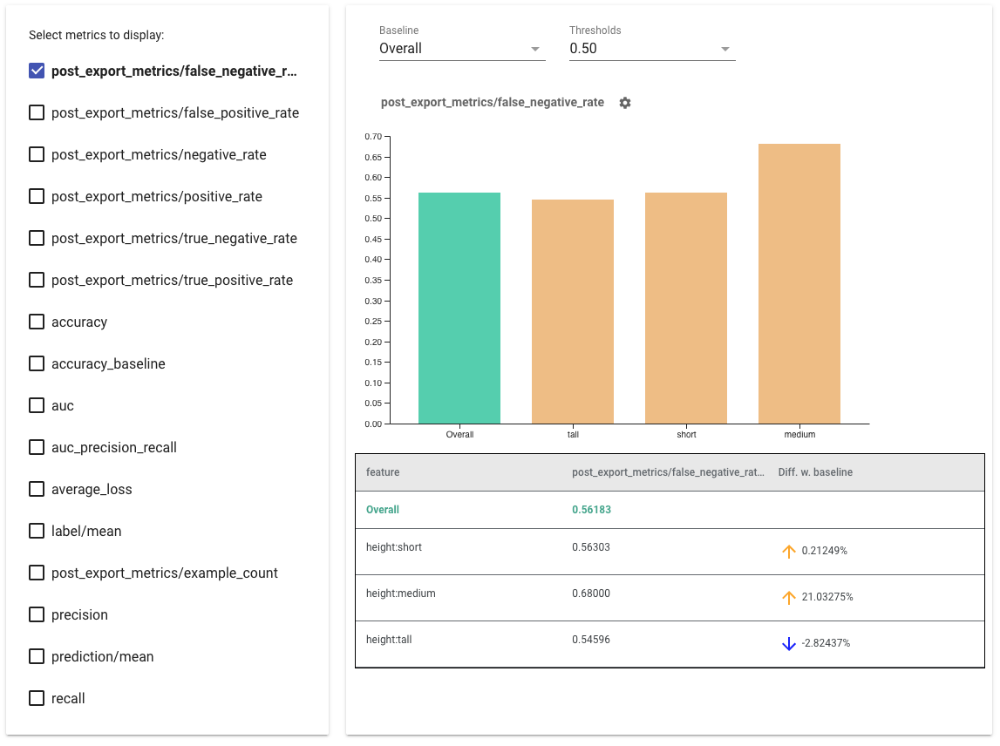

# Fairness Indicators BETA 

Fairness Indicators is designed to support teams in evaluating and improving models for fairness concerns in partnership with the broader Tensorflow toolkit.  

The tool is currently actively used internally by many of our products, and is now available in BETA for you to try for your own use cases. We would love to partner with you to understand where Fairness Indicators is most useful, and where added functionality would be valuable. Please reach out at tfx@tensorflow.org. You can provide any feedback on your experience, and feature requests, here. 

## Key links
* [Introductory Video](https://www.youtube.com/watch?v=pHT-ImFXPQo)
* [Fairness Indicators Example Colab](https://github.com/tensorflow/fairness-indicators/blob/master/examples/Fairness_Indicators_Example_Colab.ipynb)
* [Fairness Indicators: Thinking about Fairness Evaluation](https://github.com/tensorflow/fairness-indicators/blob/master/documentation/guidance.md)

## What is Fairness Indicators? 
Fairness Indicators enables easy computation of commonly-identified fairness metrics for **binary** and **multiclass** classifiers. 

Many existing tools for evaluating fairness concerns don’t work well on large scale datasets and models. At Google, it is important for us to have tools that can work on billion-user systems. Fairness Indicators will allow you to evaluate across any size of use case. 

In particular, Fairness Indicators includes the ability to:

* Evaluate the distribution of datasets
* Evaluate model performance, sliced across defined groups of users
  * Feel confident about your results with confidence intervals and evals at multiple thresholds
* Dive deep into individual slices to explore root causes and opportunities for improvement

This [Introductory Video](https://www.youtube.com/watch?v=pHT-ImFXPQo) provides an example of how Fairness Indicators can be used on of our own products to evaluate fairness concerns overtime. This Demo Colab provides a hands-on experience of using Fairness Indicators.

The pip package download includes:

* **Tensorflow Data Analysis (TFDV)** \[analyze distribution of your dataset]
* **Tensorflow Model Analysis (TFMA)** \[analyze model performance]
  * **Fairness Indicators** \[an addition to TFMA that adds fairness metrics and the ability to easily compare performance across slices]
* **The What-If Tool (WIT)** \[an interactive visual interface designed to probe your models better]

## How can I use Fairness Indicators?
Tensorflow Models

* Access Fairness Indicators as part of the Evaluator component in Tensorflow Extended \[[docs](https://www.tensorflow.org/tfx/guide/evaluator)]
* Access Fairness Indicators in Tensorboard when evaluating other real-time metrics \[[docs](https://github.com/tensorflow/tensorboard/blob/master/docs/fairness-indicators.md)]

Not using existing Tensorflow tools? No worries!

* Download the Fairness Indicators pip package, and use Tensorflow Model Analysis as a standalone tool \[[docs](https://www.tensorflow.org/tfx/guide/fairness_indicators)]

Non-Tensorflow Models

* Model Agnostic TFMA enables you to compute Fairness Indicators based on the output of any model \[[docs](https://www.tensorflow.org/tfx/guide/fairness_indicators)]

## Examples

The [examples](https://github.com/tensorflow/fairness-indicators/tree/master/examples) directory contains several examples.

* [Fairness_Indicators_Example_Colab.ipynb](https://github.com/tensorflow/fairness-indicators/blob/master/examples/Fairness_Indicators_Example_Colab.ipynb) gives an overview of Fairness Indicators in [TensorFlow Model Analysis](https://www.tensorflow.org/tfx/guide/tfma) and how to use it with a real dataset. This notebook also goes over [TensorFlow Data Validation](https://www.tensorflow.org/tfx/data_validation/get_started) and [What-If Tool](https://pair-code.github.io/what-if-tool/), two tools for analyzing TensorFlow models that are packaged with Fairness Indicators.
* [Fairness_Indicators_on_TF_Hub.ipynb](https://github.com/tensorflow/fairness-indicators/blob/master/examples/Fairness_Indicators_on_TF_Hub_Text_Embeddings.ipynb) demonstrates how to use Fairness Indicators to compare models trained on different [text embeddings](https://en.wikipedia.org/wiki/Word_embedding). This notebook uses text embeddings from [TensorFlow Hub](https://www.tensorflow.org/hub), TensorFlow's library to publish, discover, and reuse model components.

## More questions?
For more information on how to think about fairness evaluation in the context of your use case, see [this link](https://github.com/tensorflow/fairness-indicators/blob/master/documentation/guidance.md).

If you have found a bug in Fairness Indicators, please file a GitHub issue with as much supporting information as you can provide. 
